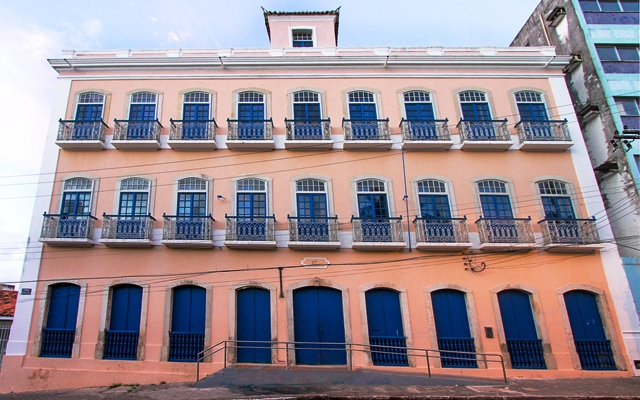
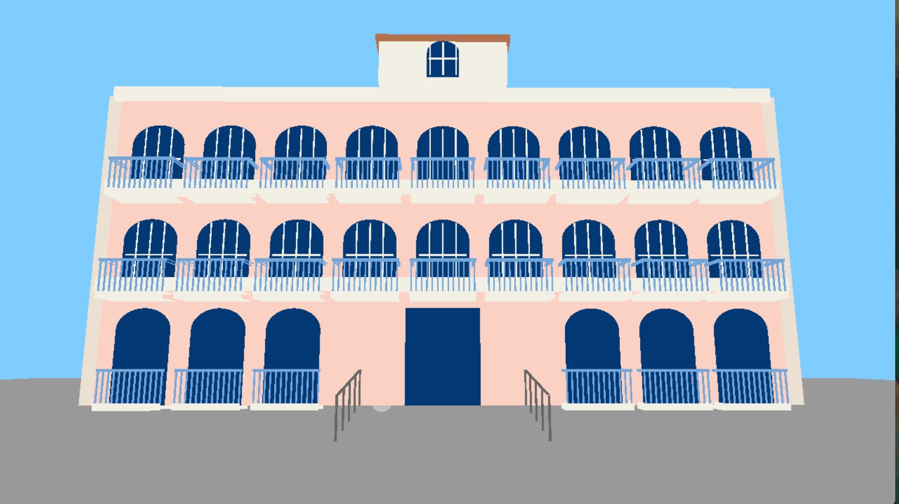
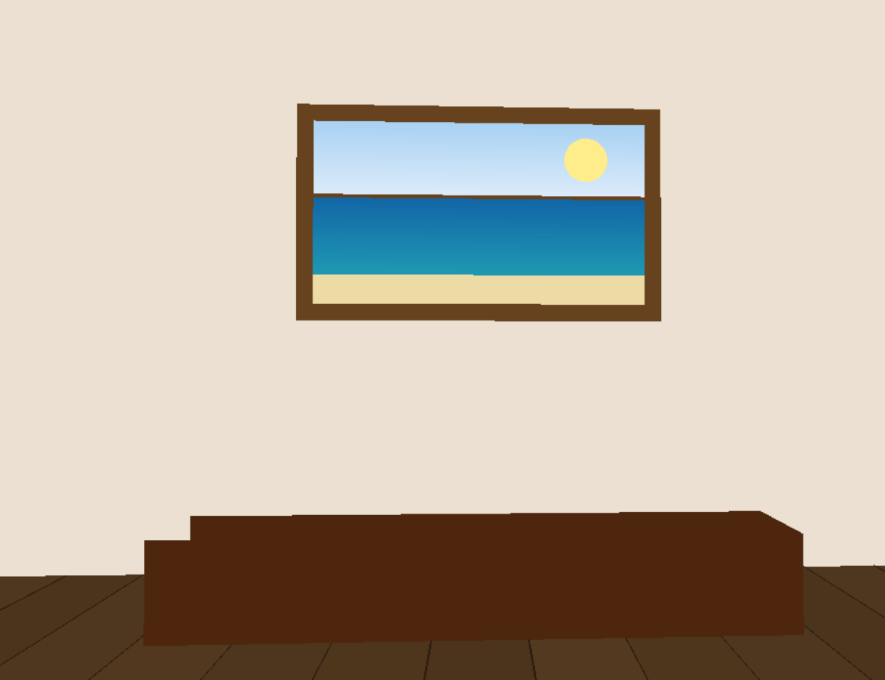

# Modelagem 3D da Biblioteca Pública de Alagoas

## 🎯 Objetivo  
Esta atividade faz parte da disciplina de **Computação Gráfica**, valendo nota na **AB1** do curso de **Ciência da Computação**.  
O objetivo é criar uma modelagem 3D da **Biblioteca Estadual em Maceió** utilizando **OpenGL**, a aplicação permite que o usuário explore a fachada e um interior simplificado do prédio histórico com uma câmera em primeira pessoa.

## 🖼 Centro Histórico 


## 🖥️ Tecnologias

- [Python 3](https://www.python.org/)  
- [OpenGL](https://www.opengl.org/)  
- [PyGame](https://www.pygame.org/news)  

## 🛠 O que precisa para rodar?  

### 1. Python 3  
- Certifique-se de ter o [Python 3](https://www.python.org/downloads/) instalado em seu computador.  

### 2. Bibliotecas  
- Abra seu terminal ou prompt de comando e instale as bibliotecas necessárias com o seguinte comando:  
  ```bash
  pip install pygame numpy PyOpenGL PyOpenGL_accelerate
  ```

## ▶️ Como rodar localmente  

1. **Clone o repositório ou baixe os arquivos do projeto.**
```bash
   git clone https://github.com/HerbertyFreire/Centro-Historico.git

   ```
2. **Abra o terminal e navegue até a pasta do projeto:**  
   ```bash
   cd Centro-Historico
   ```
3. **Entre na pasta onde está o arquivo principal (`centro.py`):**  
   ```bash
   cd centro_historico.py
   ```
4. **Execute o projeto com Python:**  
   ```bash
   python centro.py
   ```
## 👥 **Equipe**  

 - **Ezequiel Pereira Alves** 
- **José Herberty De Oliveira Freire**
- **Lara Vitória Silva Santos Barros**
 
## 🔎 Resultados




